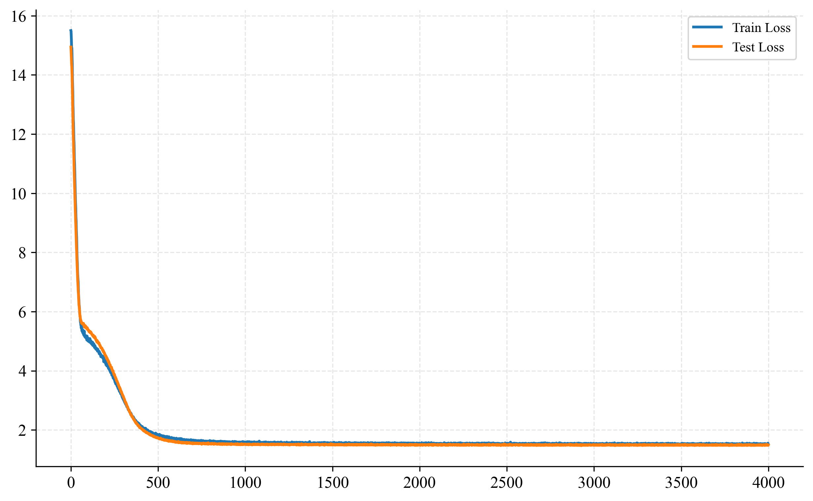
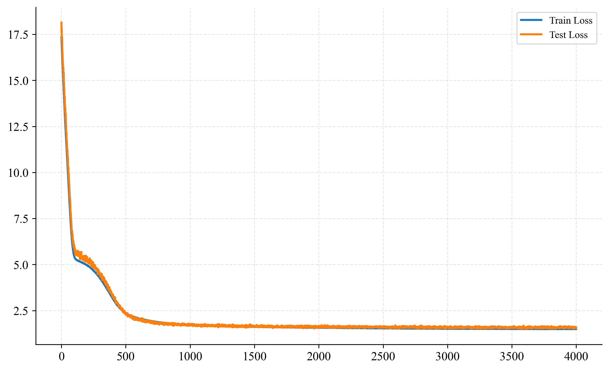
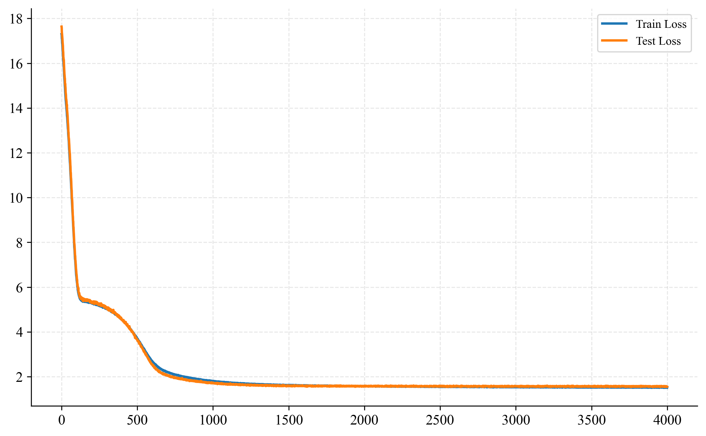
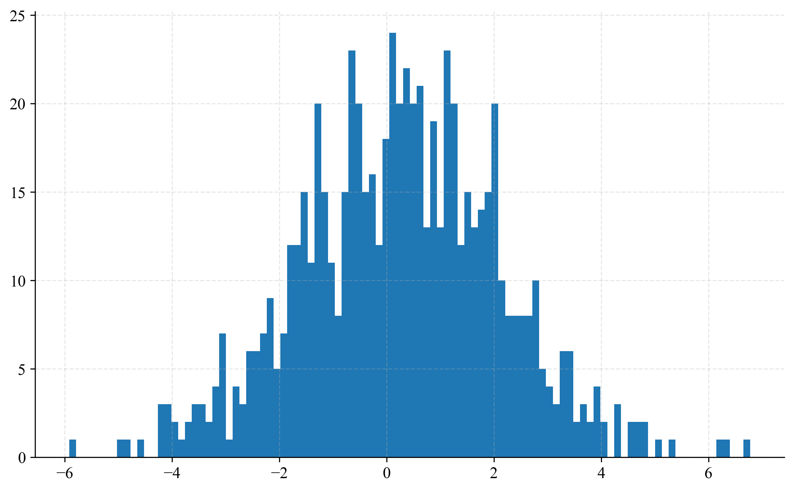

# COS 470: Basketball Model

This is a ML model that predicts the outcome of a basketball game based on the game's data.

## Dependencies

- Python 3.11
- PyTorch 2.5.1 (other versions probably work)
- Pandas
- Matplotlib
- Numpy

## Usage

```bash
python main.py <input_path>
```

## Data Splitting

I experimented with three different ways to split the data:

1. Randomly select 2 years to be the testing set.
2. Select 15% of the teams to be the testing set.
3. Select 15% of the games to be the testing set.

I didn't find any of these methods to be particularly different from the others, except that the third method seemed to take longer to converge. I ran the model with the third method twice, and each time got a slower convergance:

Log Loss for the first method:


Log Loss for the second method:


Log Loss for the third method:


Since there is no significant difference between the three methods, I chose the first method.

## Final Architecture

The final architecture is a simple feedforward neural network with 3 hidden layers:

- layer 1: 13 input features
- ReLU activation
- layer 2: 124 hidden neurons
- ReLU activation
- layer 3: 32 hidden neurons
- ReLU activation
- layer 4: 10 hidden neurons
- ReLU activation
- layer 5: 1 output neuron

I chose this architecture since it was almost certainly more complicated than necessary, and I wanted to focus on tweaking other hyperparameters. I started out with only 1 hidden layer with 24(?) neurons, but I changed it and it improved my loss at that point in time.

When running the model, I found that there was little difference between L1 Loss and MSE Loss, so I chose L1 Loss because it provided a more convenient representation of the error (i.e. the error is the absolute difference between the predicted and actual win rate). I ran 4000 epochs with a batch size of 250 and a learning rate of 1e-5, using Adam optimizer (the parameters are in the `model.py` file, but I don't understand them well enough to tweak them meaningfully). I settled on these numbers by running the model with far too many epochs and a learning rate that was too high, and then gradually decreasing the learning rate until I had a reasonable convergence, and chopped off the epochs that were not dramatically improving the performance.

## Results

The model performed moderately well, with a mean absolute error (L1 Loss) of approximately 1.5 wins. When looking at the distribution of the errors, it was approximately normally distributed, with a mean of 0, so I presume that this error is due to the natural variance of the data. With this model, I was able to correctly predict the outcome of appromimately 20% of the data exactly (i.e. the difference between the predicted and actual win rate was 0).



## Discussion

This model ended up being relatively accurate, considering that there is necessarily a lot of variance in the data. I wanted to try altering the data to try to estimate win rate instead of the number of wins, but I was running out of time and didn't want to stray too far from the original approach. 

Incredibly, I never managed to overfit the model, even when I ran it for 10000 epochs. My best guess is that the data is too noisy to be overfit, but I'm no expert.